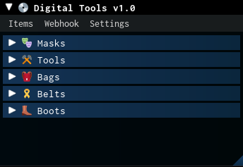

# Digital Tools v1.0

Specialized script for **Bee Swarm Simulator** developed for purchase calculations.

   

## Script

```lua
loadstring(game:HttpGet("https://raw.githubusercontent.com/vallstech/BSS-Digital-Tools/refs/heads/main/src/main.luau"))()
```


## Main Function
The script automates complex calculations related to acquiring in-game items:
*   **Calculating total purchase cost** in honey and tickets.
*   **Counting required materials** (berries, treats, pheromones, etc.) for crafting.



## Advantages
*   **Time-saving:** No more manual calculations with a calculator.
*   **Accuracy:** Eliminates human calculation errors.
*   **Convenience:** Intuitive and user-friendly interface.

## No Key

   

## OPEN SOOOOOOOOUUUURCEEEEEE!!!


